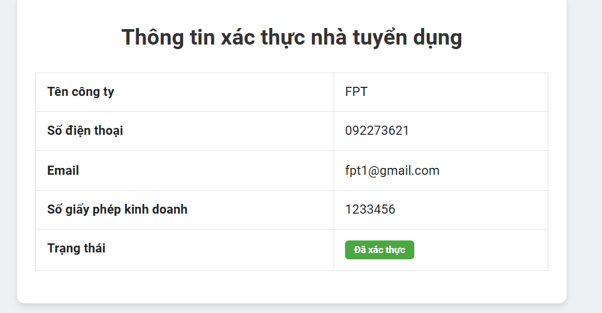
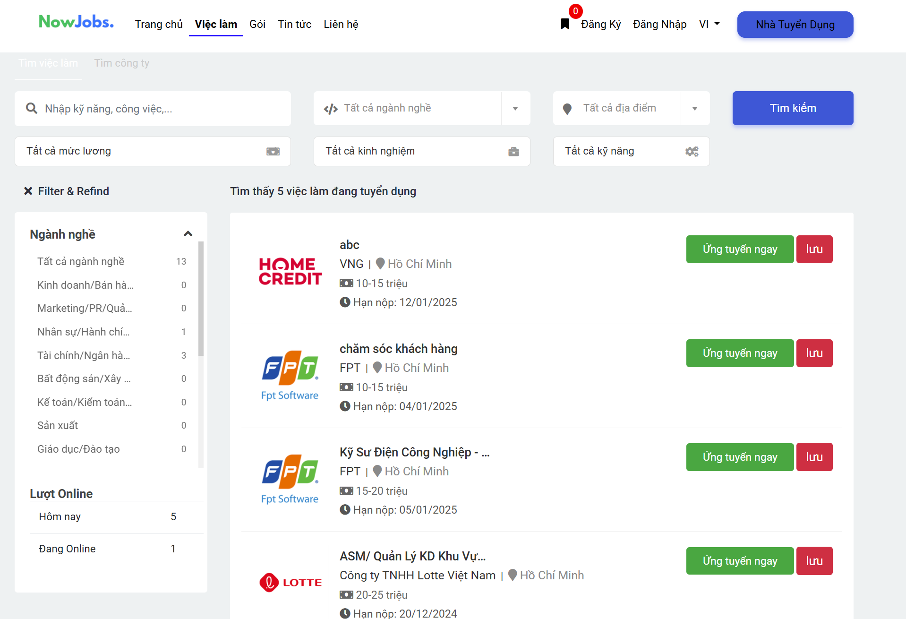
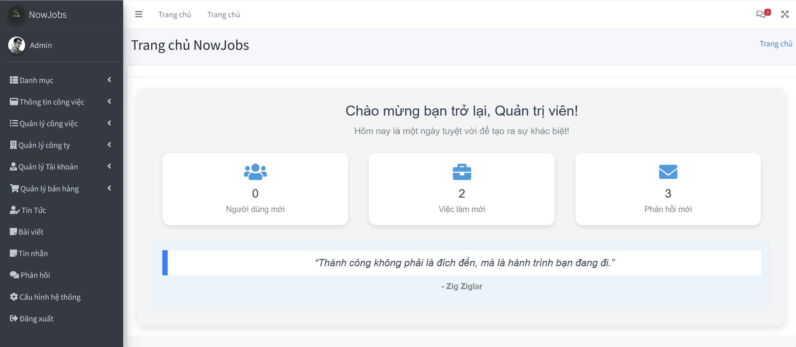
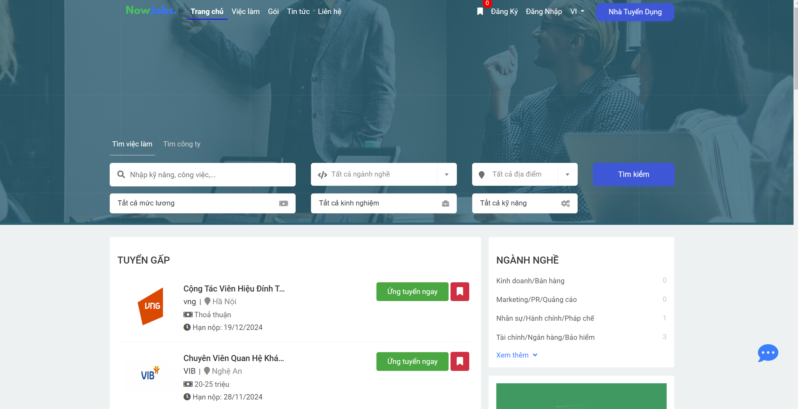

# Website Lao Động Việc Làm

Website Lao Động Việc Làm là một hệ thống hỗ trợ tuyển dụng và tìm kiếm việc làm, cung cấp nhiều chức năng để kết nối nhà tuyển dụng và người lao động. Dự án bao gồm nhiều tính năng quan trọng giúp tối ưu hóa quy trình tuyển dụng và ứng tuyển.

## Công nghệ sử dụng
- Backend: c#, Asp.net MVC
- Fontend: html, css, js, jquery, bootrap
- Database: SQL server

## Chức năng chính

### 1. Quản lý người dùng

- **Đăng ký tài khoản**: 
  - Nhập thông tin cá nhân (họ tên, email, số điện thoại, mật khẩu).
  - Xác thực email.
  - Hoàn tất đăng ký.
- **Đăng nhập**: 
  - Nhập email đăng nhập.
  - Nhập mật khẩu.
- **Quản lý hồ sơ**: 
  - Cập nhật thông tin cá nhân.
  - Tải lên CV.
  - Xem hồ sơ.

### 2. Đăng tin tuyển dụng
- **Tạo tin tuyển dụng**.
- **Chỉnh sửa tin tuyển dụng**.
- **Quản lý danh sách tin**: 
  - Xem danh sách tin tuyển dụng đã đăng.
  - Tìm kiếm tin.
  - Xóa tin tuyển dụng.

### 3. Tìm kiếm và lọc việc làm

- **Tìm kiếm theo từ khóa**.
- **Lọc việc làm**: 
  - Theo địa điểm.
  - Theo ngành nghề.
  - Theo mức lương.

### 4. Ứng tuyển việc làm

- **Nộp đơn ứng tuyển**.
- **Theo dõi trạng thái đơn ứng tuyển**.
- **Nhận thông báo từ nhà tuyển dụng**.
- **Xem danh sách đơn ứng tuyển**.
- **Gửi hồ sơ xin việc**.
- **Thêm ghi chú cho nhà tuyển dụng**.

### 5. Thông báo và cập nhật
- Thông báo về trạng thái đơn.
- Cập nhật hồ sơ.

### 6. Quản lý phản hồi
- Đánh giá ứng viên.
- Phản hồi cho ứng viên.

### 7. Thống kê và báo cáo
- Thông kê lượt truy cập.
- Xuất báo cáo tổng hợp (định dạng PDF, Excel).

### 8. Quản trị hệ thống

- **Quản lý người dùng**: 
  - Xem thông tin tài khoản.
  - Xóa tài khoản.
- **Xem báo cáo hệ thống**: 
  - Tình trạng hoạt động.
  - Các phản hồi từ người dùng.
 
@@@ 9. Một số giao diện của website lao động việc làm.
  - Trang chủ ứng viên

  - Trang danh sách việc làm

  - Trang giao diện của nhà tuyển dung

## Yêu cầu hệ thống
- Ngôn ngữ: C# (ASP.NET MVC).
- Cơ sở dữ liệu: SQL SERVER.

## Cách cài đặt

1. **Clone repository**:
    
bash
    git clone https://github.com/ngokhaihuynh/Web-Job.git

2. **Cài đặt dependencies**:
    Mở Visual Studio và mở dự án .sln trong thư mục đã clone.

3. **Cài đặt cơ sở dữ liệu**:
    - Cấu hình kết nối cơ sở dữ liệu trong Web.config.
    - Chạy migration để tạo bảng trong cơ sở dữ liệu:
      
bash
      dotnet ef database update

4. **Chạy server**:
    Mở terminal hoặc command prompt trong thư mục dự án và chạy lệnh:
    
bash
    dotnet run

    Sau đó, mở trình duyệt và truy cập http://localhost:.... để chạy ứng dụng.
